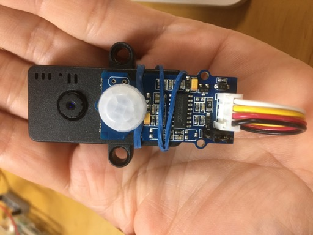
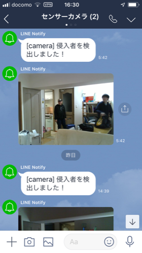
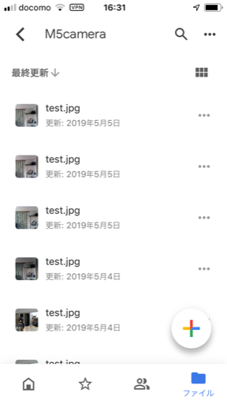

# M5Camera + Motion Sensor + LINE + GoogleDrive

## 概要

* [M5Camera](https://docs.m5stack.com/#/en/unit/m5camera)に[モーションセンサー](https://www.seeedstudio.com/Grove-PIR-Motion-Sensor.html)接続し、モーションセンサーが人の動きを検出したら、カメラで撮影した画像をLINEに通知、GoogleDriveにも保存します。
* LINEにアップロード可能な画像は制限があるため、LINEへの通知は１分のインターバルを設定しています。
* GoogleDriveには検出するたびに画像をアップロードします。







## モーションセンサー

* [モデルによってピン番号が異なる](https://docs.m5stack.com/#/en/unit/m5camera)とのことですが、13は共通でした。
* `IO13` は　`I2C` の `SCL` と書いてありますが、デジタルのINPUTに設定できます。

```
#define PIN_PIR_SIG 13  // Motion Sensor

pinMode(PIN_PIR_SIG, INPUT);

if (digitalRead(PIN_PIR_SIG) == HIGH) {
    ...
```

## カメラ

* LINEにアップロード可能な画像は、1024x1024が最大なので、画像の解像度は1024x768にしています。

* [mgo-tec電子工作](https://www.mgo-tec.com/blog-entry-m5camera-arduino.html/3)を参考に初期化。


## LINEへの送信

* [LINE Notify](https://notify-bot.line.me/ja/)でトークンを用意します。
* 通知したいルームに、`LINE Notify`を招待します。
* 下記のようにすると画像を通知できるので、同じように実装します。
    ```
    curl --trace-ascii - -X POST -H "Authorization: Bearer トークン" -F "message=メッセージ" -F "imageFile=@JPEGファイルへのフルパス" https://notify-api.line.me/api/notify
    ```

## GoogleDriveへの送信

* Google Cloud Consoleで、プロジェクトを用意します。
* Google Drive APIを有効にします。
* 認証情報で**OAuth 2.0 クライアント**を追加します。
* １回だけ、https://developers.google.com/drive/api/v3/quickstart/nodejs を参考に、認証トークンを作ります。
* OAuthで認証トークンからリクエストトークンをもらって、そのリクエストトークンでファイルをアップロードします。

## 大きな画像を送信するには

* 画像データが小さい時は、下記のように送信できます。
    ```
    client.write((const uint8_t *)fb->buf, fb->len);
    ```

* しかし、画像データが大きくなると、上記の方法では送信がうまく進みません。

* 下記のように実装することで、大きな画像データでも送信ができます。
    ```
    for (size_t sendSize = 0; sendSize < fb->len; sendSize += 1024) {
        client.write((const uint8_t *)fb->buf + sendSize, (fb->len - sendSize >= 1024) ? 1024 : (fb->len - sendSize));
        client.flush();
    }
    ```

* テストしてませんが、下記のほうがいいかもです。
    ```
    for (size_t sendSize = 0; sendSize < fb->len; ) {
        size_t sendOne = client.write((const uint8_t *)fb->buf + sendSize, fb->len - sendSize);
        if (sendOne == 0) {
            // FIXME 送信失敗？
        }
        sendSize += sendOne;
        client.flush();
    }
    ```
